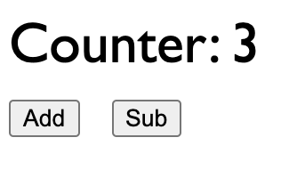

# vue3-webcomponent-wrapper-demo

A demo project for the NPM package [vue3-webcomponent-wrapper](https://www.npmjs.com/package/vue3-webcomponent-wrapper) - A wrapper that helps to convert a Vue 3 component into a Web Component.

I have created a counter component for demo. Web component tag name is `demo-counter`. [This line](https://github.com/sreenaths/vue3-webcomponent-wrapper-demo/blob/main/public/index.html#L11) shows how to pass a value as prop, and how to listen to change events from the component.

    <demo-counter value=3 onChange="console.log('Value is :', event.detail);"></demo-counter>

Following is a screenshot of the demo.



## Project setup
```
npm install
```

### Compile and load
```
npm run serve
```
